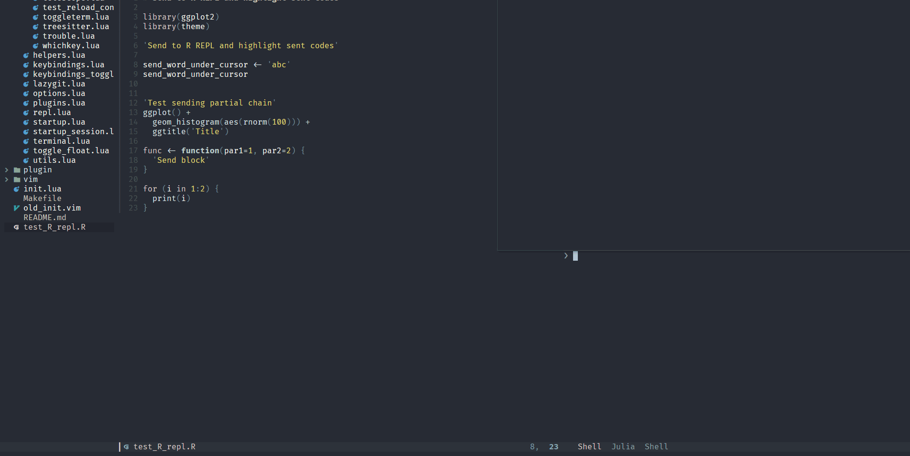

# Neovim's config

I am back to Neovim 😋. Home sweet home. My setup is mainly for R and Julia and it might help you with migrating to Neovim.

[Neovim 0.5](https://github.com/neovim/neovim/commit/a5ac2f45ff84a688a09479f357a9909d5b914294) is really exciting, with its native LSP, treesitter and Lua API.

I just spent about one month _relentlessly_ setting up and hacking my Neovim so I can use it as soon as possible. Pretty much setup most things the way I wanted. Now I try to feature-freeze, refactor, cleanup and pay off technical debts. _This repo is a subdirectory of my private repo containing some sensitive files, extracted out for sharing. Feel free to use it._

Some quick summary of my setups
- Neovim's built-in terminal emulator to replace my Tmux
- For session management, I use [abduco](https://github.com/martanne/abduco). Attach/detach Neovim sessions and/or specific process
- Theme [minimalist.nvim](https://github.com/kar9222/minimalist.nvim)
- Vim-like keybindings for plot (not related to Neovim)
- LSP
  - Completion [nvim-cmp](https://github.com/hrsh7th/nvim-cmp)
  - LSP's UI [lspsaga](https://github.com/glepnir/lspsaga.nvim)
  - Symbols outline [symbols-outline](https://github.com/simrat39/symbols-outline.nvim)
  - Signature [lsp_signature](https://github.com/ray-x/lsp_signature.nvim)
  - Snippets [LuaSnip](https://github.com/ray-x/lsp_signature.nvim)
  - Diagnostics [trouble.nvim](https://github.com/folke/trouble.nvim)
- Terminal
  - Terminal buffer management [neoterm](https://github.com/kassio/neoterm)
  - CLI and Neovim integration (e.g. open file from terminal in neovim) [nvr](https://github.com/mhinz/neovim-remote) and [neomux](https://github.com/nikvdp/neomux)
    - `open my_file`
    - `ff`: call `ff` command in CLI and use telescope.nvim to preview and open file in Neovim
    - Send command or copy registers from CLI to Neovim, or vice verse
  - Use nvim as git editor for commit/rebase/etc
  - Floating terminal window management [toggleterm](https://github.com/akinsho/toggleterm.nvim)
- REPL
  - I customize my own REPL for _sending to terminal_ and _highlighting_ the codes sent e.g.
    - Send word under cursor
    - Send `str`, `names` and help `?` for word under the cursor
    - Send line/paragraph/selection/motion
    - Send language-specific (R and Julia) blocks/code-blocks (e.g. R's function/for loop, Julia's function/struct/for loop)
    - Send chain (e.g. R's chain `%>%`)
    - Send partial chain. I stole the idea from [MilesMcBain/breakerofchains](https://github.com/MilesMcBain/breakerofchains).
    - fzf-like history search for R REPL. For Julia, use [JLFzf.jl](https://github.com/Moelf/JLFzf.jl).
- RMarkdown
    - Go to prev/next chunk and highlight chunk
    - Send chunk to REPL and highlight chunk
    - Chunk object (e.g. change/delete/select) chunk with `if`, `af`, etc
- Git
  - Syntax-highlighting pager [delta](https://github.com/dandavison/delta)
    - e.g. `<leader>gb` preview diff for current file, `<leader>gd` preview diff
  - Terminal UI [lazygit](https://github.com/jesseduffield/lazygit) with delta integration
  - Magit clone for Neovim [neogit](https://github.com/TimUntersberger/neogit)
  - Git decorarions [gitsigns](https://github.com/lewis6991/gitsigns.nvim)
- fzf-like find/filter/preview [telescope.nvim](https://github.com/nvim-telescope/telescope.nvim)
- Search & replace panel [nvim-spectre](https://github.com/windwp/nvim-spectre)
- orgmode-like note-taking apps [neorg](https://github.com/nvim-neorg/neorg)
- Motion (This is real good!) [lightspeed](https://github.com/ggandor/lightspeed.nvim)
- Autopairs [auto-pairs](https://github.com/jiangmiao/auto-pairs)


Other R-related setup
- R REPL terminal output [{colorout}](https://github.com/jalvesaq/colorout)
- {theme} for R packages: {ggplot2}, {plotly}, {shiny}, {rmarkdown}, {ggdist}, {ggdag}, etc


# Gallery

## Overview


## Search & replace


## LSP

### Go to symbol (document/workspace)

NOTE You can
- Filter symbols by class (e.g. function, variable) with `<c-l>` and
- Query as usual


### Go to definition & references


### Symbols outline


### Signature


### Diagnostics


### Completion


## REPL

I customize my own REPL for _sending to terminal_ and _highlighting_ the codes sent e.g.
- Send word under cursor
- Send `str`, `names` and help `?` for word under the cursor
- Send line/paragraph/selection/motion
- Send language-specific (R and Julia) blocks/code-blocks (e.g. R's function/for loop, Julia's function/struct/for loop)
- Send chain (e.g. R's chain `%>%`)
- Send partial chain. I stole the idea from [MilesMcBain/breakerofchains](https://github.com/MilesMcBain/breakerofchains).
- fzf-like history search for R REPL. For Julia, use [JLFzf.jl](https://github.com/Moelf/JLFzf.jl).

## R REPL



## RMarkdown

- Go to prev/next chunk and highlight chunk
- Send chunk to REPL and highlight chunk
- Chunk object (e.g. change/delete/select) chunk with `if`, `af`, etc


### R REPL fzf-like history search

Interactive R history search. Great for single-line history search and can be used together with native {radian} REPL's `ctrl+r` multi-line history search.

<details>
<summary>R history search</summary>
<br>

```bash
#! /bin/bash

# R history: Remove duplicates, commented lines, blank lines, starting `+` symbol
# NOTE the location of your ~/.radian_history. Should be the default.
tac ~/.radian_history                    | \
    awk '!a[$0]++'                       | \
    sed -e '/^#/d  ;  /^$/d  ;  s/^+//g' | \
    fzf --exact --no-sort
```

</details>
<br>


### Terminal buffer management

I use multiple terminals on the right windows, with named terminal buffers on the statusline (R, Julia and shell). Use [neoterm](https://github.com/kassio/neoterm) to manage it, bind `Tprev` and `Tnext` for navigating between multiple terminals.


### [abduco](https://github.com/martanne/abduco) session management

<details>
<summary>abduco</summary>
<br>

```bash
#! /bin/bash

# Usage:
# NOTE `:qa` exits nvim and hence it kills the session. Hence only use it if the intention is to kill the session. To quit without killing the session, for example
# - detach session
# - close the terminal window.

# unset NVIM_LISTEN_ADDRESS  # TODO Need this for SSH?
session=`basename $PWD`

# If the session isn't exist, force creation of session when there is an already terminated session of the same name, after showing its exit status.
# And attach to the session.
# Detach key is <c-/>
abduco -e ^_ -fA $session nvim
```

</details>
<br>

### CLI & Neovim integration

CLI is still the best when it matters. You can call Neovim from CLI

- `open my_file`
- `ff`: call `ff` command in CLI and use telescope.nvim to preview and open file in Neovim (see [lua/plugins/telescope.lua](lua/plugins/telescope.lua) for Lua functions)

<details>
<summary>Bash code to call Neovim Lua function from CLI</summary>
<br>

```sh
# Save directory for telescope's find_files_custom_dir and find_files_live_grep
save_dir() { echo $PWD | vc 'z' }
ff() {  # Find files in custom directory
    save_dir
    nvr -c 'lua find_files_custom_dir()'
    nvr -c 'startinsert'
}
aff() {  # Find files (inc. hidden) in custom directory
    save_dir
    nvr -c 'lua find_files_hidden_custom_dir()'
    nvr -c 'startinsert'
}
iff() {  # Find files (inc. hidden & ignored) in custom directory
    save_dir
    nvr -c 'lua find_files_hidden_ignore_custom_dir()'
    nvr -c 'startinsert'
}
ge() {  # Live grep
    save_dir
    nvr -c 'lua live_grep_custom_dir()'
    nvr -c 'startinsert'
}
```

</details>
<br>


## Git

### Syntax-highlighting pager [delta](https://github.com/dandavison/delta)

- `<leader>gb` preview diff for current file
- `<leader>gd` preview diff
- `<c-s>` stage
- `<c-u>` unstage
- Use `less`-like navigation `d`, `u`, `f` and `b`
- `q` quit


### Terminal UI [lazygit](https://github.com/jesseduffield/lazygit) with delta integration


### Magit clone for Neovim [neogit](https://github.com/TimUntersberger/neogit)


### Git decorarions [gitsigns](https://github.com/lewis6991/gitsigns.nvim)


## Vim-like keybindings for plot (not related to Neovim)

For plot, I use [httpgd](https://gist.github.com/kar9222/be90067e4256aaea124eb0f30db63d99)

- Focus/minimize plot
- Toggle position at top right window (re-position right terminals to bottom)
- Increase/decrease window size
- Move plot window left/right/up/down

<details>
<summary>Plot</summary>
<br>

```ahk
#ifWinActive ahk_group plot  ; TODO Clashes key with vscode.ahk

plot__toggle_activate_minimized:
^!p::
winGet, state, minMax, R Plot
if (state == -1)  ; Minimized
    winActivate, R Plot
else  ; Not minimized
    winMinimize, R Plot
; TODO Bug: Window is activated but not focus e.g. keybindings not working. Hacky workaround: call `msgbox` with minimal timeout so that it disappear almost instantly. When it disappears, R plot windows is focused.
msgbox,,,, 0.001
return

; Init and restore R plot window, hacky solution to enlarge/restore shell pane, etc TODO Optimize
plot_toggle := 0
plot__toggle_init_restore:
+!p::
    setKeyDelay, 100
    toggle := ! toggle

    ; Init plot
    if (toggle = 1) {
        winActivate ahk_exe WindowsTerminal.exe
        winWaitActive ahk_exe WindowsTerminal.exe
        send ^+!{f8}  ; Call nvim's plot_init

        ; R plot window: set `alwaysOnTop` and position to top-right corner
        winActivate R Plot
        winWaitActive R Plot
        winSet, alwaysOnTop, , R Plot
        winMove, R Plot, , 1044, -32, 881, 597  ; NOTE Also move and resize to default size. Same as win_pos___standard
        send !{tab}
    }
    ; Restore plot
    else {
        winActivate ahk_exe WindowsTerminal.exe
        winWaitActive ahk_exe WindowsTerminal.exe
        send ^+!{f7}  ; Call nvim's plot_restore

        ; R plot window: set `alwaysOnTop` and restore default position
        winActivate R Plot
        winWaitActive R Plot
        winSet, alwaysOnTop, , R Plot
        winMove, R Plot, , 523.5, 166  ; Same as from .Rprofile
        winMinimize, R Plot
    }
    ; Restore default
    setKeyDelay, -1
return


; _ Navigation, window management ---------------

#ifWinActive R Plot

plot__minimize:
p::
winMinimize A
return

plot__increase_size:
i::
; Increase width and height by 25%
; Move upper-left: decrease x and y by 25%
winActivate R Plot
winGetPos, x, y, width, height, A
winMove, A, , .75*x, .75*y, 1.25*width, 1.25*height
return

plot__decrease_size:
e::
; TODO Correct? Very slightly diff compared to default size. Test by `plot__increase_size`, `plot__decrease_size`, `get_info_of_active_window`
; Decrease width and height by 20% (1/1.25 == .8)
; Move lower-right: increase x and y by 33% (1/.75 == 1.33)
winActivate R Plot
winGetPos, x, y, width, height, A
winMove, A, , 1.33*x, 1.33*y, .8*width, .8*height
return

plot__move_win_up:
+k::
winGetPos, , y, , , A
winMove, A, , , y-200
return

plot__move_win_dn:
+j::
winGetPos, , y, , , A
winMove, A, , , y+200
return

plot__move_win_left:
+h::
winGetPos, x, , , , A
winMove, A, , x-200
return

plot__move_win_right:
+l::
winGetPos, x, , , , A
winMove, A, , x+200
return
```

</details>
<br>


## Other great stuffs

[Rust's implementation of process/system monitor](https://github.com/ClementTsang/bottom)

### CLI file manager(https://github.com/kamiyaa/joshuto)


## Other R-related stuffs

### R terminal output

See [My {colorout}](https://gist.github.com/kar9222/0e1130c15bfaba3a71f0cf6d1d08931f)


### Custom {skimr} summary stats

See [Custom {skimr} summary stats](https://gist.github.com/kar9222/c9c0c55d01ce88bbc3a96981e71b7cae)


### Use R help system with Vimium

[Use R help system with Vimium](https://gist.github.com/kar9222/0a0d22db4bd8d6ca1652f97305538b07)


### R theme package

{theme} for R packages: {ggplot2}, {plotly}, {shiny}, {rmarkdown}, {ggdist}, {ggdag}, etc.

See [{theme}](https://github.com/kar9222/theme)


# Summary of my opinions for my setup

In my config, you will realize I love using
- Tabs for multiple workspace (like virtual desktop environment), e.g. for
  - terminal UI lazygit
  - Neogit
  - splitting windows for different files and/or terminals
  - basically anything
- Floating terminal so that I can focus it in the center of my screen, with the option of re-positioning it to the right of the window. See [lua/plugins/toggleterm.lua](lua/plugins/toggleterm.lua)

REPL: There are many REPL plugins out there like vim-slime, but they lacks some features which I use. Hence, I customize them myself.

telescope.nvim: Alternative to fzf, telescope is native to Neovim, hence it has better integration/keybinds/etc and much more easily customize/hack.

Neovim's built-in terminal emulator to replace my Tmux
- Pros
  - Better overall integration and easier to hack
  - Better keybindings integration
  - Use everything (e.g. floating window/terminal) in full screen inside neovim
- Cons
  - Redraw issues
  - Minor issues I can live with

For completion, I am happy with [nvim-cmp](https://github.com/hrsh7th/nvim-cmp) and some of its features. [coq_nvim](https://github.com/ms-jpq/coq_nvim) is the fastest but for me, it's 'too fast', poping out too frequently. I just love old-school typing and manually trigger completion when I need it. I also played with it and feel free to use my config [lua/plugins/coq_nvim.lua](lua/plugins/coq_nvim.lua). I might use it in the future.


# Authors

This repo is mainly for sharing my setup. Thank you open source.

Some idea and codes are _stolen_ from others lol. (I have no idea how to cite/credits them, please let me know if I have done anything in this regard or miss out your names, thanks!). I have included their repo and name in the file e.g. see vim/repl.vim.

Hence, I would like to credits them, and the they are also the authors of this repo
- [Jakson Alves de Aquino](https://github.com/jalvesaq)
- [Kassio Borges](https://github.com/kassio)
- [Miles McBain](https://github.com/MilesMcBain)

If you'd like your name removed please let me know, thanks.
